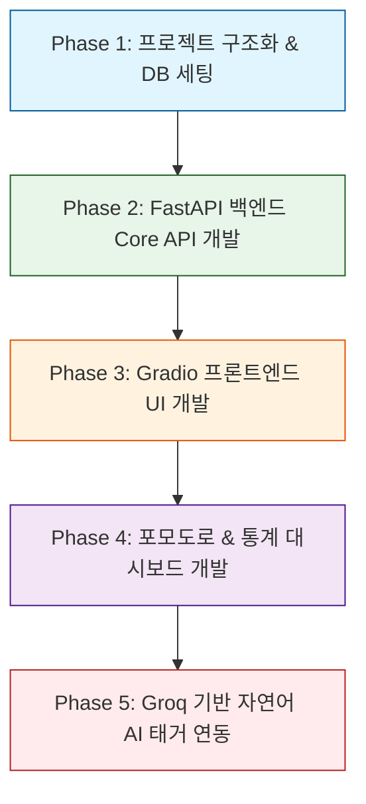

# ZenTodo 단계별 구현 계획서 (Step-by-Step Implementation Plan)

본 계획서는 ZenTodo 프로젝트의 백엔드(FastAPI), 프론트엔드(Gradio), 데이터베이스(SQLModel), AI(Groq)를 단계별로 점진적이고 안전하게 구축하기 위한 실행 로드맵입니다. 여러 작업자가 병렬적으로 작업하거나 단계별 피드백을 수월하게 받기 위해 독립적인 검증 단계를 포함하고 있습니다.

---

## 📅 단계별 로드맵 요약

---

## 🛠️ 상세 단계별 작업 정의

### Phase 1: 프로젝트 초기화 및 DB 세팅 (Core Setup)
* **목표:** 가상 환경 의존성 설정, 폴더 구조 구성 및 SQLite 데이터베이스 연동.
* **주요 작업:**
  - `requirements.txt` 생성 및 패키지 설정 (`fastapi`, `uvicorn`, `gradio`, `sqlmodel`, `groq`, `requests`, `python-dotenv`, `pytest` 등).
  - 프로젝트 폴더 트리 스켈레톤 물리적 생성.
  - `app/api/database.py` 구현: SQLModel 엔진 및 SQLite 데이터베이스 세션 팩토리 설정.
  - `app/api/models.py` 구현: `Todo` DB 테이블 설계 (id, title, content, priority, category, due_date, is_completed, created_at 등).
* **검증 방법:**
  - 데이터베이스 테이블 생성 스크립트 실행 후 로컬에 `database.db` 파일이 생성되는지 확인.

### Phase 2: 백엔드 Core 개발 - FastAPI REST API & Service (Backend Core)
* **목표:** UI 없이 단독으로 테스트가 가능한 핵심 투두 CRUD API 완성.
* **주요 작업:**
  - `app/api/services/todo_service.py` 구현: 비즈니스 연산 로직(기한 만료 및 D-Day 계산, 우선순위 기반 정렬, CRUD 핵심 쿼리) 작성.
  - `app/api/routes/todos.py` 구현: REST API 엔드포인트 작성 (`GET`, `POST`, `PUT`, `DELETE`).
  - `app/main.py` 구현: FastAPI 앱 기본 인스턴스 기동 및 API 라우터 등록.
* **검증 방법:**
  - uvicorn 서버 구동 후 FastAPI Swagger UI (`http://127.0.0.1:8000/docs`)에 접속하여 CRUD 요청 시 정상 JSON 응답 확인.

### Phase 3: 프론트엔드 Core 개발 - Gradio UI & CSS (Frontend Core)
* **목표:** API와 통신하며 동작하는 세련된 Glassmorphism 테마 UI 연동.
* **주요 작업:**
  - `app/ui/api_client.py` 구현: `requests` 라이브러리를 활용해 백엔드 API를 호출하는 래퍼 함수 작성.
  - `app/ui/styles/custom.css` 작성: 다크 네이비 테마 및 반투명 Glassmorphism 효과 CSS 주입.
  - `app/ui/components/todo_list.py` 및 `app/ui/dashboard.py` 구현: 투두 입력 폼 및 개별 카드 형태의 투두 리스트 출력 (HTML 컴포넌트 활용).
  - `app/main.py`에 `gr.mount_gradio_app` 마운트 적용.
* **검증 방법:**
  - 브라우저에서 `http://127.0.0.1:8000/` 접속하여 실제 투두를 추가/수정하고 화면에 정상 렌더링되는지 확인.

### Phase 4: 포모도로 & 대시보드 통계 계산 연동 (Analytics & Focus Timer)
* **목표:** 시간 관리 및 활동 현황 분석 시각화 통합.
* **주요 작업:**
  - `app/api/routes/pomodoro.py` & `app/api/routes/analytics.py` 백엔드 컨트롤러 개발.
  - `app/api/services/stats_service.py` 구현: 최근 30일간의 완료 개수를 기반으로 깃허브 잔디 스타일 색상(초록색 그라데이션)을 포함한 HTML 그리드 렌더링 연산.
  - `app/ui/components/pomodoro.py` 구현: Gradio UI 집중 카운트다운 타이머 탑재.
  - `app/ui/components/stats_panel.py` 구현: 잔디 그리드 HTML 및 카테고리/주간 통계 컴포넌트 반영.
* **검증 방법:**
  - 집중 세션을 완료한 후, 대시보드 통계 그리드 및 카테고리 비율 차트 데이터가 실시간으로 증가하여 갱신되는지 확인.

### Phase 5: Groq AI 자연어 태거 추가 (AI Feature Integration)
* **목표:** 자연어 문장을 파싱해 투두 정보를 자동 생성하는 편의성 지능화 기능 완성.
* **주요 작업:**
  - `app/llm/client.py` 구성: 환경 변수에서 `GROQ_API_KEY`를 가져와 Groq 클라이언트 인스턴스 초기화.
  - `app/llm/services/tagger.py` 작성: 사용자의 할 일 자연어 문장을 분석하여 마감 기한, 카테고리, 우선순위를 추출하고 지정된 Pydantic JSON 스키마 형태로 반환하도록 프롬프트 작성 및 연동.
  - `app/api/routes/llm.py` API를 구성하고, 이를 Gradio UI 입력 부분에 연동.
* **검증 방법:**
  - UI 입력 창에 `"내일 밤 10시까지 디자인 시안 제출하기"` 입력 시, AI 파싱을 통해 기한(내일), 카테고리(업무), 우선순위(High)가 자동으로 매칭되어 저장되는지 테스트.

---

## 📈 검증 및 테스트 계획

* **자동화 테스트:** pytest 라이브러리를 통해 백엔드 연산 및 API 유효성 검사 코드를 상시 테스트합니다 (`pytest tests/`).
* **수동 및 UI 테스트:** 각 구현 단계 완료 후, FastAPI Swagger UI 및 Gradio UI 웹 브라우저를 띄워 인터랙티브 애니메이션과 데이터 흐름의 정상 여부를 교차 검증합니다.
